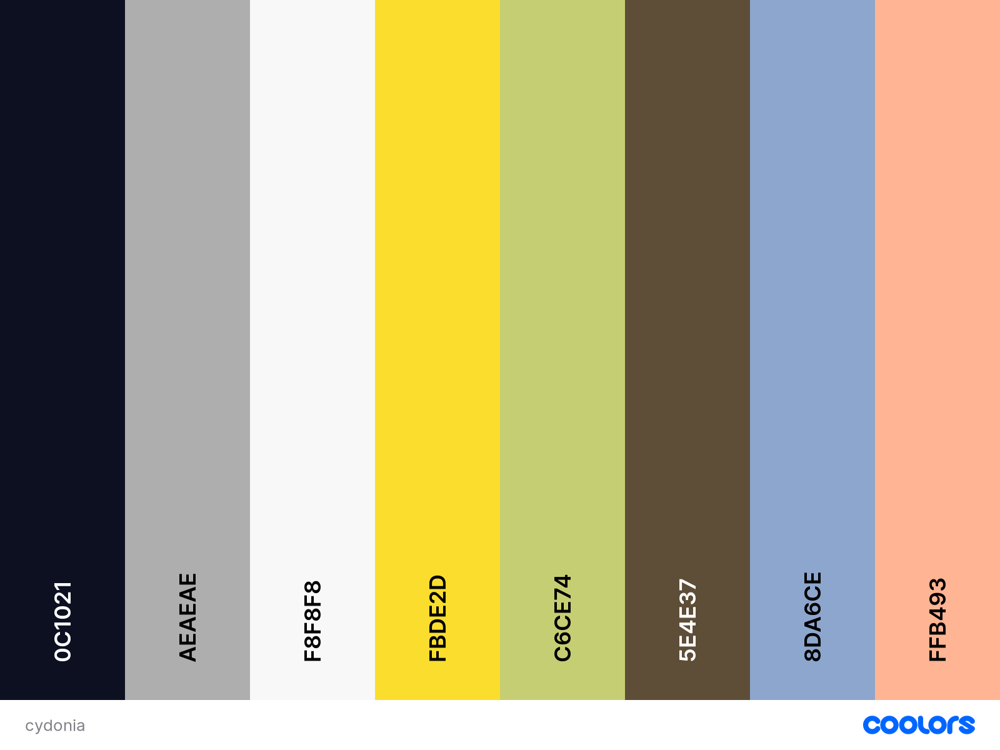
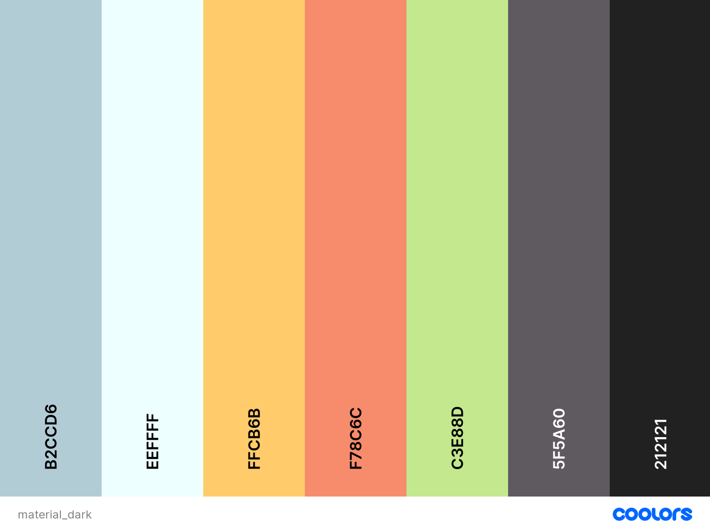
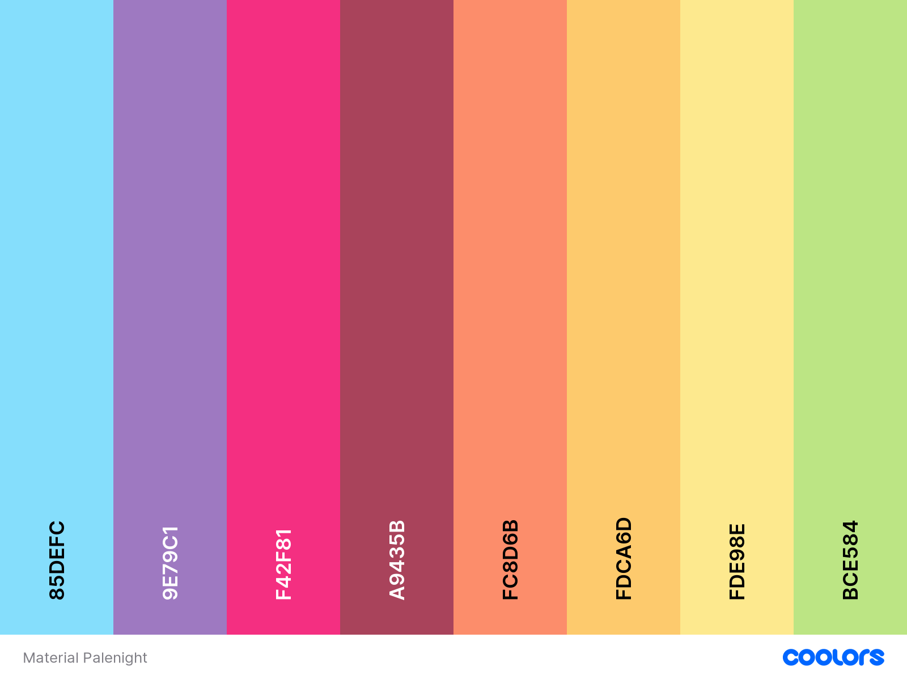

# Notepad++ Curated Look

Custom color schemes, both themes and language definitions, for Notepad++.

I upload here themes and color schemes I love to use with Notepad++, including some definitions for not-so-popular languages I use often (full list below)

Everything painfully handcrafted by a human :gift_heart:.

## Installation

User-defined languages in Notepad++ are mostly (painfully) handcrafted. UDL styler files will override your theme colors, in many instances (see the [official reference](https://npp-user-manual.org/docs/user-defined-language-system/#udl-and-themes) for more details).
For this reason, this repository is structured in folders organized by supported themes.

You may install all themes without conflict.

You may want to choose to install only the UDLs of your go-to theme. All UDLs in this repository indicate which theme they are compatible with.

### Submodules

This repository includes original third-party themes as git submodules. Downloading the repository won't download the original themes.

Cloning the repository will not clone the original themes. You'll have to run the following commands first:
```
git submodule init
git submodule update
```

or run `git clone` with the `--recurse-submodules` option.

### Installing themes

If in trouble, consult the [official guide](https://github.com/notepad-plus-plus/nppThemes) on how to install Notepad++ themes.

1. Close Notepad++;
2. Clone this repository locally, or download a copy;
3. Import the xml files from this repository `themes\` by placing them in your `themes\` folder:
 - For most installations, copy the content of the `themes` folder to `%APPDATA%\Roaming\Notepad++\themes`
 - If you have multiple users on the same computer, and want the theme available to all users on that machine, put it into `C:\Program Files\Notepad++\themes\` (or `C:\Program Files (x86)\Notepad++\themes for a 32-bit Notepad++`)
 - For portable installations, instead put the themes in the `themes\` sub-folder under the directory where your portable `notepad++.exe` resides
4. Restart Notepad++
5. Select your newly installed theme from Preferences > Style Configurator

### Installing User Defined languages (UDL)

If in trouble, consult the [official guide](https://github.com/notepad-plus-plus/userDefinedLanguages?tab=readme-ov-file#using-a-udl-from-this-collection) on how to install Notepad++ UDLs.

1. Close Notepad++;
2. Clone this repository locally, or download a copy;
3. Import the xml files from this repository `userDefinedLangs` by placing them in your local `userDefinedLangs` folder:
 - For most installations, copy the content of the `userDefinedLangs` to `%APPDATA%\Roaming\Notepad++\userDefinedLangs`:
4. Restart Notepad++.


## Supported Themes

- Default: this folder contains vanilla (light) UDL definitions for all supported languages from this package;

- [Cydonia](https://github.com/daemonPainter/npp_custom_colors/tree/master/Cydonia): Handcrafted theme based on vanilla npp Blackboard theme made by me;

- [Material Dark](https://github.com/naderi/material-theme-for-npp): I loved ths theme a lot, many kudos to *naderi* for this one;

- [Material Palenight](https://github.com/samsebastien/material-palenight-npp): Lovely porting of one of the most popular dark coding themes, many kudos to *samsebastien* for this.

## Supported Languages

- DXL
- GAWK/AWK
- Markdown
- VSQ

## Additional Resources

I like to play with fonts as well. My recommendation for something popular would be [Fira Code](https://github.com/tonsky/FiraCode), although it needs some steps to make it work fine on Notepad++.

My go-to workhorse font would be [Consolas](https://en.wikipedia.org/wiki/Consolas).

### Color Palettes

It's much easier to talk palettes than anything else :D




